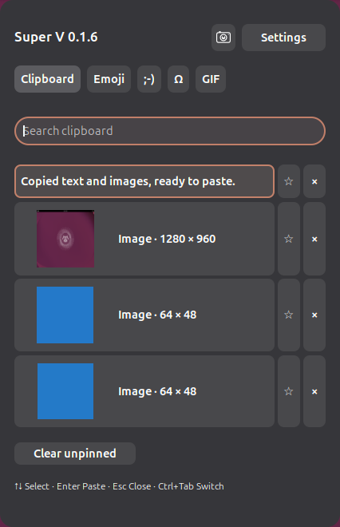
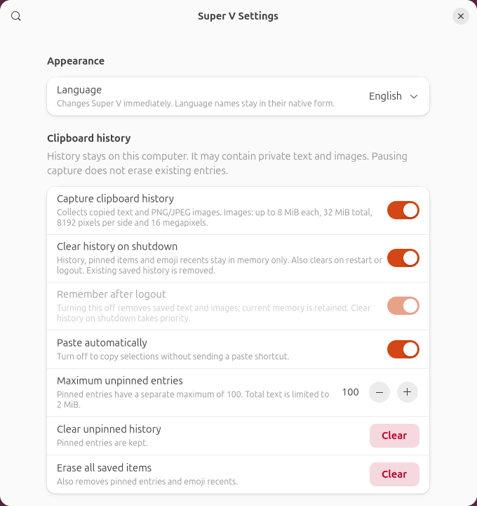
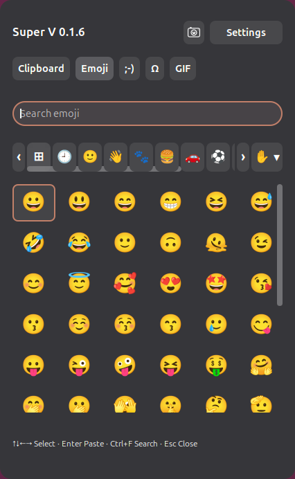

# Super V Ubuntu

A Windows-style **Super+V** picker for Ubuntu GNOME, with text and image clipboard history,
screenshots, emoji, kaomoji, symbols, and local GIF favorites. Open the popup, search, and
insert a selection using the keyboard or mouse. Everything stays on your computer.
GPL-3.0-or-later; Unicode data uses Unicode-3.0.

[English](README.md) · [简体中文](docs/i18n/README.zh-CN.md) ·
[繁體中文](docs/i18n/README.zh-TW.md) · [日本語](docs/i18n/README.ja.md) ·
[Español](docs/i18n/README.es.md) · [Français](docs/i18n/README.fr.md) ·
[한국어](docs/i18n/README.ko.md)

**Current release: [v0.1.6](https://github.com/LincolnGothic/super-v-ubuntu/releases/tag/v0.1.6)** ·
[Download installer](https://github.com/LincolnGothic/super-v-ubuntu/releases/download/v0.1.6/super-v-ubuntu_0.1.6_all.deb) ·
[First installation](#install-the-debian-package) · [Upgrade](#upgrade-from-an-older-version) ·
[Feature guide](#use-v016) · [Troubleshooting](#troubleshooting)

**Release status:** automated logic, package, and isolated GNOME Wayland checks
are available. Image capture, native screenshot capture, and GTK image paste
are covered by the isolated tests. Full application and desktop acceptance is
tracked in [testing](docs/testing.md). See [v0.1.6 validation](docs/verification-v0.1.6.md).

## Target platform

Ubuntu 24.04 LTS / GNOME Shell 46 and Ubuntu 26.04 LTS / GNOME Shell 50,
using Wayland. APIs were inspected against tagged GNOME 46.0 and 50.1 sources.
Metadata and Debian dependencies allow these two Shell versions. GNOME 47–49,
51 and later, X11, and non-GNOME desktops are not declared supported.
Neither target has completed real desktop acceptance testing.
No `xdotool`, Electron, or background daemon is
used. GNOME extensions run inside the shell; use the desktop test procedure
before relying on this implementation.

## Use v0.1.6

Open **Super+V**, then click the gear button in the header to open Settings.

| Task | How to do it |
| --- | --- |
| Paste text or an image from history | Copy text or PNG/JPEG image pixels, open Super+V, and choose an entry. The receiving app must support the selected content. |
| Take a screenshot | Click the camera button or press **Super+Shift+S**, then select an area, window, or screen. Reopen Super+V to find the captured image. |
| Change the screenshot shortcut | **Settings → Desktop integration → Screenshot shortcut (GTK accelerator syntax)**. Enter a shortcut such as `<Super><Shift>s` and apply it; an empty field disables the shortcut. |
| Clear history when the computer shuts down | Turn on **Settings → Clipboard history → Clear history on shutdown**. It is off by default and also clears on restart, logout, or extension reload. |
| Choose a language | **Settings → Appearance → Language**. All seven languages are included in the same installer and apply immediately. |
| Pick an emoji or character | Use the emoji, kaomoji, or symbols tab, choose a category in the horizontal bar, and click an item in the grid. |

Screenshot capture enters history when **Capture clipboard history** is enabled.
The shutdown option removes existing saved history and keeps the current session's
text, images, pins, and emoji recents only in memory. GNOME's separately saved
files in Pictures/Screenshots remain. See the [screenshot](#take-a-screenshot)
and [shutdown](#clear-history-on-shutdown) instructions for details.

## Screenshots

**Text and image history — v0.1.6**

Copied images share the clipboard list with text. The camera button opens
GNOME’s screenshot controls.



**Clipboard settings — v0.1.6**

Clear history on shutdown is enabled in this example, which disables persistent
history while keeping current items in memory.



**Emoji picker — v0.1.6**

The six-column grid, horizontal category bar and compact skin-tone selector.



Captured from v0.1.6 in isolated GNOME Shell 50.1 Wayland sessions with synthetic
clipboard items and bundled emoji. Full desktop acceptance is tracked in
[testing](docs/testing.md).

## Install the Debian package

Already using Super V? Follow [Upgrade from an older version](#upgrade-from-an-older-version).

Download [`super-v-ubuntu_0.1.6_all.deb`](https://github.com/LincolnGothic/super-v-ubuntu/releases/download/v0.1.6/super-v-ubuntu_0.1.6_all.deb)
from [release v0.1.6](https://github.com/LincolnGothic/super-v-ubuntu/releases/tag/v0.1.6),
then open a terminal in the folder containing the downloaded file and run:

```sh
sudo apt install ./super-v-ubuntu_0.1.6_all.deb
```

**Save your work, log out, and log back in** so GNOME discovers the system
extension. Then run these commands as your ordinary user, without sudo:

```sh
gsettings set org.gnome.shell.keybindings toggle-message-tray "['<Super>m']"
gnome-extensions enable super-v-ubuntu@super-v-ubuntu.local
gnome-extensions info super-v-ubuntu@super-v-ubuntu.local
gnome-extensions prefs super-v-ubuntu@super-v-ubuntu.local
```

GNOME normally assigns both Super+V and Super+M to notifications. The first
command leaves notifications on Super+M so Super+V can open this extension.
It replaces any custom notification shortcut. To restore GNOME's defaults,
run `gsettings reset org.gnome.shell.keybindings toggle-message-tray` after
disabling this extension.

Press **Super+V**; the header should show **Super V 0.1.6**. Capture begins after
extension initialization, with a default
100-entry limit and persistent history. Change preferences to pause capture,
disable persistence or automatic paste, and choose another shortcut.
Enabling this extension grants it access to clipboard text and images; read
[the privacy notes](SECURITY.md).

## Upgrade from an older version

1. Download the [v0.1.6 installer](https://github.com/LincolnGothic/super-v-ubuntu/releases/download/v0.1.6/super-v-ubuntu_0.1.6_all.deb).
2. Open a terminal in the download's folder and run the command below. Installing
   it over the previous package upgrades Super V; no uninstall is needed.

   ```sh
   sudo apt install ./super-v-ubuntu_0.1.6_all.deb
   ```

3. **Save your work, log out, and log back in.** On Wayland, GNOME keeps the
   extension's previous code loaded until you start a new session.
4. Press **Super+V** and check that the header shows **Super V 0.1.6**. Your
   language and shortcut settings remain. Saved text history, pins, and emoji
   recents migrate; history configured to clear at logout is erased as requested.

To check both the installed package and the extension loaded by GNOME, run
these commands as your ordinary user:

```sh
dpkg-query -W super-v-ubuntu
gnome-extensions info super-v-ubuntu@super-v-ubuntu.local
```

The package should report **0.1.6**; the extension's **Version** should also
report **0.1.6** (the internal extension number is 7). If the package is new but
GNOME still reports an old version, log out/in before reinstalling.

The extension's **Path** should be
`/usr/share/gnome-shell/extensions/super-v-ubuntu@super-v-ubuntu.local` for the
Debian package. A user-local copy of the same UUID overrides this system copy.
If Path points into your home directory, back up and move only that UUID's
directory outside `${XDG_DATA_HOME:-$HOME/.local/share}/gnome-shell/extensions`,
then log out/in to load the system package. If Super+V does not open afterward,
follow [Troubleshooting](#troubleshooting).

## Languages

One installer includes English, Simplified Chinese, Traditional Chinese, Japanese,
Spanish, French and Korean. Open **Super+V → Settings → Appearance → Language**
to choose a language for Super V. The interface, preferences and localized search
update immediately, without logging out or changing Ubuntu's display language.
Language names stay in their native form so you can always switch back.

The default, **Follow system**, uses the GNOME session language. Unsupported
languages and missing messages fall back to English. Changing Ubuntu's session
language itself still requires logging out/in.

Chinese is selected by script/region: Taiwan, Hong Kong and Macau use Traditional
Chinese; mainland China, Singapore and generic Chinese use Simplified Chinese.
Spanish and French use a shared translation across their regional locales.
Emoji names, search keywords, kaomoji/symbol labels, settings, notifications and
accessible control labels are localized. English emoji and character names remain
searchable in every language. See [translation contributions](docs/translations.md).

Emoji categories appear in a single horizontal icon bar, with translated tooltips
and a selected highlight. Use the arrows or horizontal scrolling to reveal more
categories. Focus a category and use Left/Right or Home/End to move along the bar;
Enter selects it and Down moves into the grid. Kaomoji and symbols use horizontal
category labels. The hand button opens a skin-tone menu.

## Position and dismissal

Click the input field you want to use, then press Super+V. By default the panel
opens near the mouse pointer and stays inside that monitor's work area. In
Settings, **Picker position → Center of screen** restores centered placement.
The shortcut remains the trigger; clicking an input field alone does not open
the panel. Pointer placement is approximate: GNOME does not expose a universal
text-caret position across application toolkits. Clicking anywhere outside
the panel closes it without pasting; Escape and Super+V also close it.

## Clipboard

Copied plain text appears newest first. Exact duplicates move to the front
without losing their pin. Unicode and multiline contents are preserved; the
popup uses short, single-line previews, while the full text is restored to the
clipboard. Search matches normalized, case-insensitive terms. History never
transmits data. Text over 16 KiB is ignored rather than truncated. Ordinary
history defaults to 100 entries (configurable 1–500); up to 100 pins survive
ordinary trimming and **Clear unpinned**. A total 2 MiB text budget may trim
ordinary entries earlier than their count limit.

Copied **PNG and JPEG images** appear in the same history with a thumbnail and
pixel dimensions. Choose an image to copy its original bytes and send your
application’s paste shortcut; the receiving app must accept images. Images can
be pinned and deleted just like text. Search matches “Image” in your chosen
language, PNG/JPEG, or dimensions; it does not search text inside images.
Copying an image file or a URL is different from copying image pixels.

Images are limited to **8 MiB each and 32 MiB total**, including pins, with at
most 8192 pixels per side and 16 megapixels. Older unpinned images are removed
when that budget is full. PNG/JPEG data is checked before a bounded thumbnail
is decoded. Other image formats and rich text are ignored. Existing text
history, pins, and emoji recents migrate on upgrade.

Use Up/Down to select, Enter to paste, Delete to remove the selected entry,
Escape to close, Ctrl+F to focus search, and Ctrl+Tab to cycle through all five tabs.
Tab navigates controls; the pin and delete buttons have accessible labels.
Mouse selection is supported. Preferences can erase pins and emoji recents too.
Clear requests made while disabled are applied on the next enable.

Automatic paste returns focus and sends a virtual-keyboard shortcut. Ctrl+V is
the default; recognized terminal IDs use Ctrl+Shift+V. Configure exact IDs/WM
classes under **Apps using Ctrl+Shift+V**, or set **Paste overrides**, for example:

```json
{"kitty":"ctrl-shift-v","some.editor.desktop":"shift-insert","special.app":"manual"}
```

Allowed values are `ctrl-v`, `ctrl-shift-v`, `shift-insert`, and `manual`. If
the destination disappears, focus changes, physical modifiers stay held, or
injection fails, the item remains on the clipboard for manual paste. The
extension cannot verify that a receiving application accepted the text.

## Take a screenshot

Click the camera button in the Super+V header or press **Super+Shift+S** to open
GNOME’s screenshot controls. Choose an area, window, or screen and capture it.
The picker closes before capture, and GNOME places the PNG on the clipboard;
Super V adds it to history while capture is enabled and within the image limits.
The normal Print Screen shortcut remains available. Change or disable the new
shortcut in **Settings → Desktop integration → Screenshot shortcut**; an empty
field disables only this shortcut.

GNOME also saves screenshots in **Pictures/Screenshots**, following its normal
settings. Clearing Super V history removes Super V’s stored copies; it does not
delete GNOME’s screenshot files or overwrite the system clipboard.

## Clear history on shutdown

Open **Settings → Clipboard history → Clear history on shutdown**. This option
is off by default. When enabled, all history, including images, pins and emoji
recents, stays only in memory. It also clears on restart, logout, or extension
reload. Enabling it removes existing saved history, after pending writes finish,
while retaining the current session’s items in memory. It takes priority over
**Remember after logout**. Returning to persistent history requires disabling
this option and enabling Remember after logout.

## Emoji

The bundled database contains 3,944 fully-qualified Emoji 17.0 sequences,
including ZWJ, flags and skin-tone combinations, with CLDR 48 names and keywords in the six additional languages and English.
Search by name, keyword or emoji. Select All, Recent or a Unicode group directly
from the horizontal category bar; the hand button opens the skin-tone menu.
All includes mixed-tone sequences; individual tones match uniform variants.
Recents are capped at 30 and follow the persistence preference.

Emoji appear as large symbols in a six-column grid, with fewer columns on
narrow monitors. Up/Down move between rows and focus the grid; Left/Right
then move between emoji. Enter inserts the selected emoji, or click a tile.
Use Ctrl+F to return to search, where Left/Right still move the text cursor.
Emoji names remain available to screen readers. More results load as keyboard
selection passes the current page, or with **Show more**.

Emoji insertion saves the previous bounded plain-text clipboard in memory,
copies the emoji, and sends the configured paste shortcut. Reopen the popup
and choose **Restore clipboard** after paste has finished if you want the old
text back. Restoration only happens if the clipboard still contains that
emoji; newer copies are preserved. There is no timed restoration, since a
Wayland paste consumer provides no reliable completion acknowledgment here.
Images, rich-text formats, oversized text and password-marked clipboard data
are not snapshotted. Temporary emoji and restore writes do not enter history.
New emoji may appear as missing glyphs with older installed emoji fonts.
The database is complete even where the system font cannot render a sequence.

## Kaomoji, symbols and GIFs

The **;-)** tab contains text emoticons, and **Ω** contains math symbols, Greek
letters, arrows, currency, punctuation and units. Search by name or character,
choose a category, and click or press Enter to insert. Their grids use the same
keyboard navigation and guarded prior-text restoration as emoji.

In **Settings → GIF favorites**, choose local `.gif` files. The GIF tab previews
their first frame and searches filenames. Up to 40 favorites are supported;
each file must be at most 8 MiB with dimensions no larger than 2048 × 2048.
Files remain in their original location, so moving or deleting one requires
re-adding it. Removing a favorite does not delete the original file.

Choosing a GIF copies the original `image/gif` bytes and sends the normal paste
shortcut. The destination must accept images; some apps paste a still frame
or do not accept this format. GIF insertion replaces the clipboard without a
restore snapshot, and image data does not enter text history. There is no
online GIF search, account, API key or runtime network request.

## Privacy

Everything stays local. There is no telemetry, synchronization, analytics,
logging of clipboard contents, or runtime network access. Persistent state is
plaintext at `${XDG_STATE_HOME:-$HOME/.local/state}/super-v-ubuntu/history.json`,
with image files in its `images/` subdirectory and 0700 directory/0600 file modes. Common password-manager MIME hints are
rejected; focused-app exclusions are best effort because Mutter does not
provide reliable origin identities for every copy. Private browsing and
password fields without a hint are not automatically detected. See `SECURITY.md`
for exact erasure steps and limitations.

## Build and development

On Ubuntu 24.04:

```sh
sudo apt install build-essential debhelper libglib2.0-bin nodejs python3 gettext locales eslint gjs \
    gir1.2-gtk-4.0 gir1.2-adw-1 gir1.2-gdkpixbuf-2.0 lintian git gh
make test
make package
lintian --fail-on error,warning ../super-v-ubuntu_0.1.6_all.deb
```

No npm dependencies or runtime downloads are required. Debian's build invokes
the checks, ESLint, Node tests and GJS integration tests itself. `make package`
uses debhelper/dpkg-buildpackage and writes the `.deb` into the parent directory.
`make install-local` installs just the runtime extension for your current user;
run it without sudo, log out/in, then enable the UUID as above. This user copy
takes precedence over a system copy, so remove it when testing the `.deb`.
See `docs/development.md`, `docs/architecture.md` and `CONTRIBUTING.md`.

## Troubleshooting

**Super+V does not open:** check `gnome-extensions info` below. If the extension
is disabled, run `gnome-extensions enable super-v-ubuntu@super-v-ubuntu.local`
without sudo. If Super+V opens notifications, run the notification-shortcut
command in [First installation](#install-the-debian-package); Super+M will still
open notifications.

**An old version or missing new settings:** follow the package, loaded-version,
and Path checks in [Upgrade](#upgrade-from-an-older-version). Save your work and
log out/in after an installation or upgrade.

**Cannot open Settings from the picker:** run
`gnome-extensions prefs super-v-ubuntu@super-v-ubuntu.local` without sudo.

First inspect version, session and extension state:

```sh
gnome-shell --version
printf '%s\n' "$XDG_SESSION_TYPE"
gnome-extensions info super-v-ubuntu@super-v-ubuntu.local
journalctl --user -b -o cat | rg 'super-v-ubuntu|Super V|JS ERROR'
```

If the extension was newly installed or its code changed, log out/in on Wayland.
Alt+F2 then `r` does not restart a Wayland shell. A shortcut conflict may require
changing the GTK accelerator in preferences, e.g. `<Control><Alt>v`. GNOME's
extension system cannot always detect another program claiming the same key.
If a terminal does not paste, add its identifier or select a paste override.
If capture is missing, check capture/exclusion settings, the 16 KiB text limit and the image limits.
Corrupt state is erased with a generic notification, without copying it into
logs or retaining backups. Report shell errors with clipboard content redacted.

## Uninstall

```sh
gnome-extensions disable super-v-ubuntu@super-v-ubuntu.local
sudo apt remove super-v-ubuntu
```

Uninstalling does not remove user history. To erase it, follow `SECURITY.md`.
For a user-installed copy, disable it first and remove only its UUID directory:

```sh
rm -rf -- "${XDG_DATA_HOME:-$HOME/.local/share}/gnome-shell/extensions/super-v-ubuntu@super-v-ubuntu.local"
```

## Publish

GitHub Actions validates and builds each main-branch push. After these checks
pass, the release job publishes the package and `SHA256SUMS` for the version
in `package.json`, then downloads them again to verify the checksum. Existing
versioned releases are left unchanged. Pull requests do not publish releases.
The release job alone has repository contents-write permission; the build
job uses read-only permission. See the repository's Actions page for actual
run results. The dated record in `docs/verification.md` describes local checks
performed before initial publication, not current GitHub publication status.

This checkout includes `scripts/publish.sh`. After committing on main, run
`gh auth login`, then `./scripts/publish.sh`. It creates a PUBLIC
`<authenticated-account>/super-v-ubuntu` repository, pushes source, waits for
successful CI, builds from a clean checkout, checks lintian, creates `v0.1.6`,
uploads the `.deb` and SHA256SUMS, and downloads the release asset to verify it.
It refuses a different origin or an existing private repository. Actual remote
publication is recorded separately from local build success.
